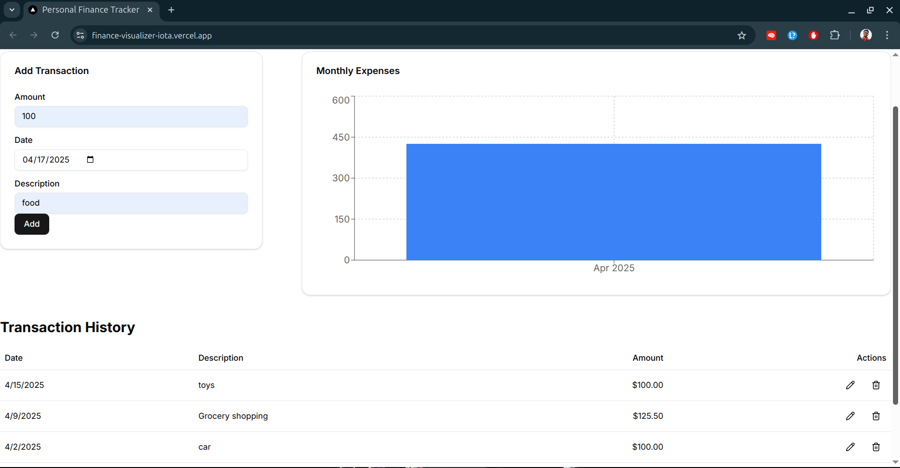

# Finance Tracker

A modern and intuitive personal finance tracking application that helps you manage your expenses and visualize your spending patterns.




## Features

- 📊 Track your daily expenses and income
- 📅 View transactions by date
- 📈 Visualize spending patterns with monthly charts
- 📱 Responsive design works on desktop and mobile
- 🔄 Real-time updates

## Tech Stack

### Frontend

- **Framework**: [Next.js 15](https://nextjs.org/) with React 19 and TypeScript
- **UI Components**: [shadcn/ui](https://ui.shadcn.com/)
- **Styling**: [Tailwind CSS](https://tailwindcss.com/)
- **Charts**: [Recharts](https://recharts.org/)
- **Icons**: [Lucide React](https://lucide.dev/)
- **Notifications**: [Sonner](https://sonner.emilkowal.ski/)

### Backend

- **API**: [Finance API](https://github.com/AbdurRohit/finance-api)
- **Database**: MongoDB
- **Server**: Node.js with Express
- **Authentication**: JWT (JSON Web Tokens)

## Getting Started

### Prerequisites

- Node.js 18.0 or later
- npm or yarn

### Installation

1. Clone the repository:
   ```bash
   git clone https://github.com/yourusername/finance.git
   cd finance
   ```

2. Install dependencies:
   ```bash
   npm install
   # or
   yarn install
   ```

3. Create a `.env.local` file in the root directory and add:
   ```
   NEXT_PUBLIC_API_URL=http://localhost:3001
   ```

4. Start the development server:
   ```bash
   npm run dev
   # or
   yarn dev
   ```

5. Open [http://localhost:3000](http://localhost:3000) with your browser to see the application.

## Backend Setup

The backend repository is available at [https://github.com/AbdurRohit/finance-api](https://github.com/AbdurRohit/finance-api). Follow the instructions in the backend repository to set up the API server.

